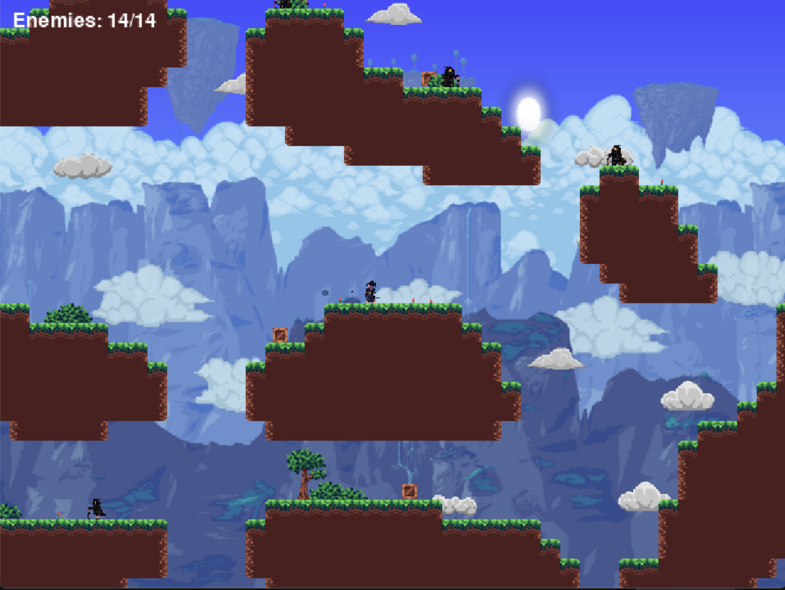
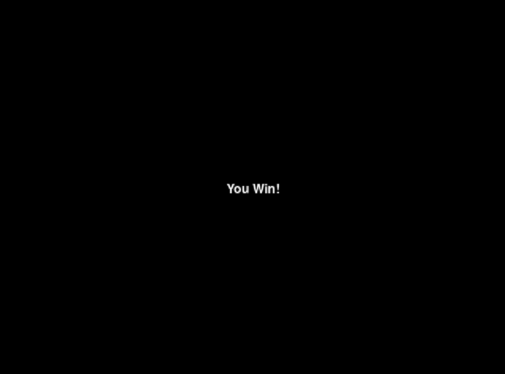

# The Samurai Dash [(Video Demo)](https://drive.google.com/file/d/1aTKiqxKs1ou5ulQWpxsKqohnXStutEbR/view?usp=sharing)
This code is to make a game that is caled "Samurai Dash". This game is really simple where you need to elminate the enemies on the map until all of the enemies are all dead. The enemies also can shoot projectiles at you so you need to be careful and eliminate them without getting hit by it. There are 3 levels you need to complete to win this game.
 
# Python files
- finaleprojecto.py - The main file to run the game.
- map.py - The file to load the tiles and the physics of it.
- entities.py - The file to load, set the physics, and set the actions of each entities in the game (Player, Enemy).
- editor.py - The file to create the map editor, so I can create my own map.
- cloud.py - The file to load the clouds and configure the layering for each cloud.
- particles.py - The file to load the particles from trees and player when dashing.
- utils.py - The file to make a function to load images and handle the animation of the sprites.
- spark.py - The file to load the spark that is polygon shaped.

# How to install
1. Download the file as a zip file
2. Extract it to a file that you wanted it in to
3. Open the file finaleprojecto.py with a python language (Pycharm, Visual Studio Code)
4. Click run to open the game.
5. Have fun!

# How to Win
1. Find and eliminate all of the enemies on the map by dash into them
2. Dodge their projectiles (You can dash into them to dodge the projectiles)
3. There's 3 levels with a 3 different maps and you need to complete all of it to win
- (You need to eliminate 8 enemies in level 1)
- (You need to eliminate 10 enemies in level 2)
- (You need to eliminate 14 enemies in level 3)
4. After its completed, finally You Win!

# Player Abilities
- Double jump (Press 2x 'W' or 'Space')
- Dash attack (Press 'Shift')

# Enemy Abilities
- Shoots projectiles (Whenever the player is in front the enemy, it will shoot out the projectile)

# Controls
- **W** or **Space** : Jump (Double jump if you press it twice)
- **A**, **D** : Move left and right
- **Shift** : Dash attack

# Editor's Control (Map Creating)
- **W**,**A**,**S**,**D** : Move the screen up and down, right and left
- **Scroll** : Choose the tiles that is being displayed on the top left screen
- **Scroll + Shift** : Scroll throught the tile variants
- **Left Click** : Put tile
- **Right Click** : Delete tile
- **T** : To automatically adjust the tile variant based on its position
- **O** : Save the map
- **G** : Make the tile to be placed on a offgrid position

# The levels
## Level 1

## Level 2

## Level 3

## Win Screen

### Inspired by [youtube video](https://www.youtube.com/watch?v=2gABYM5M0ww&t=20736s) 

